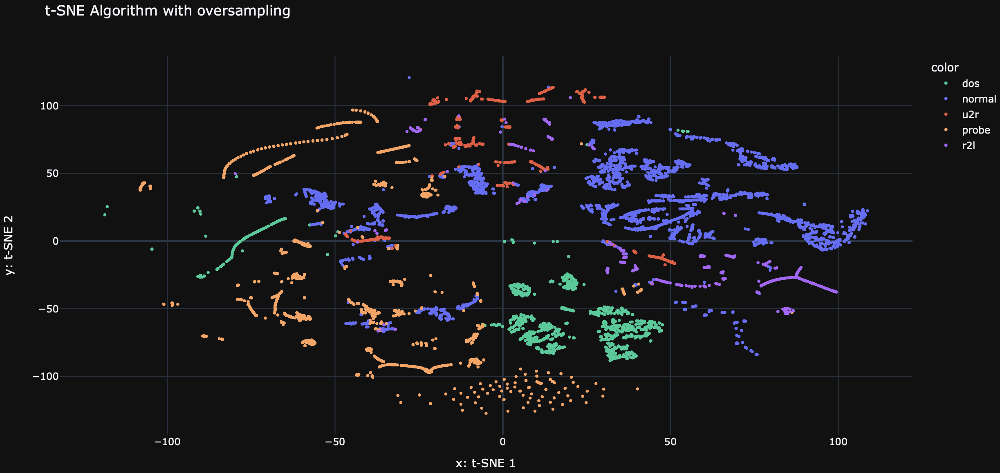
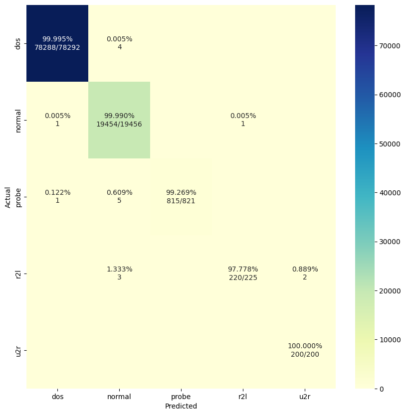

# Network Intrusion Detection System

This repository contains a machine learning project focused on developing a classifier to accurately differentiate between intrusive (malicious) and non-intrusive (benign) network traffic.

## Project Overview

The objective of this project is to analyze and evaluate methods within the field of intrusion detection. Utilizing a comprehensive dataset, a predictive model was developed to classify network connections as either normal or as various types of attacks, with precise categorization for each specific attack type.

> [Here is the animated presentation of the project.](https://www.canva.com/design/DAGBT2SaVYM/TflYMLkLgUNVdMI1IJC9Hg/view?utm_content=DAGBT2SaVYM&utm_campaign=designshare&utm_medium=link&utm_source=editor) 

## Data Description

The dataset utilized in this project is derived from a network environment emulating a standard U.S. Air Force LAN, infused with a variety of simulated attacks. The data, provided by Lincoln Labs, encompasses nine weeks of raw TCP dump data processed into connection records, each uniquely labeled and detailed.     
The dataset can be accessed [here](http://kdd.ics.uci.edu/databases/kddcup99/kddcup99.html).

Within these records, each connection is defined by a series of TCP packets occurring between well-defined times, moving data between source and destination IP addresses under specified protocols. The connections are annotated as normal or as one of the following types of attacks:

- **DOS (Denial-of-Service)**: These attacks target the availability of resources and include methods such as SYN floods.
- **R2L (Remote to Local)**: These incidents involve unauthorized access attempts from remote machines, which may employ tactics like password guessing.
- **U2R (User to Root)**: Attacks where a local user attempts to gain unauthorized superuser (root) privileges through, for example, buffer overflow attacks.
- **Probing**: The act of surveying a network to gather information or find known vulnerabilities, such as port scanning.

## Methodology

### Data Management and Preprocessing

- **Data Version Control (DVC) with GCP Bucket:** Employed DVC integrated with a Google Cloud Platform (GCP) bucket for data management.
- **Removal of Highly Correlated Variables:** Conducted an analysis to identify and remove variables with high correlation to mitigate the risk of overfitting.
- **Encoding and Scaling:** Applied appropriate encoding techniques to categorical variables and scaled numerical variables to standardize the dataset.
- **Dimensionality Reduction:** Utilized Principal Component Analysis *(PCA)*, *t*-SNE *(t-Distributed Stochastic Neighbor Embedding)* and UMAP *(Uniform Manifold Approximation and Projection)* for advanced dimensionality reduction. These techniques helped to visualize the data's structure and identify patterns or clusters within the dataset.

### Model Development and Evaluation

- **Baseline Model:** Implemented a Random Forest classifier as the baseline model to evaluate the dataset's classification performance.
- **Oversampling with SMOTE:** After analyzing the initial model results, particularly the underrepresentation of certain attack classes, **SMOTE** *(Synthetic Minority Over-sampling Technique)* was employed to balance the dataset. This approach significantly improved the model's ability to detect rare attack types.
- **Performance Metrics:** Emphasized the **F1 score** as the primary metric for evaluating model performance, striking a balance between **Precision** *(accuracy of attack labeling)* and **Recall** *(comprehensiveness in detecting actual attacks)*. 

## Visualization

To gain insights into the distribution and clustering of the network connections, we utilized the t-SNE (t-Distributed Stochastic Neighbor Embedding) algorithm for dimensionality reduction and visualization. The t-SNE plot below represents the network connections in a two-dimensional space, where each point corresponds to a connection record.

The t-SNE plot provides a visual representation of the relationships between different types of network connections. It helps us understand the patterns and similarities among the connections, which can be useful for identifying clusters and potential anomalies.

By examining the t-SNE plot, we can observe the separation between different attack types and normal connections. This visualization aids in understanding the effectiveness of our model in distinguishing between intrusive and non-intrusive network traffic.

## Model Performance

### Before SMOTE
Here are the classification metrics for our baseline Random Forest model:

| Class  | Precision | Recall | F1-Score | Support |
|--------|-----------|--------|----------|---------|
| dos    | 1.00      | 1.00   | 1.00     | 78292   |
| normal | 1.00      | 1.00   | 1.00     | 19456   |
| probe  | 1.00      | 1.00   | 1.00     | 822     |
| r2l    | 1.00      | 0.96   | 0.98     | 225     |
| **u2r** | **0.75** | **0.60** | **0.67** | **10** |
|        |           |        |          |         |
| Accuracy |       |    | 1.00     | 98805   |
| Macro Avg | 0.95      | 0.91   | 0.93     | 98805   |
| Weighted Avg | 1.00   | 1.00   | 1.00     | 98805   |

> ***F1 Score (average weighted) 99.9752%***

### After SMOTE
Following the application of SMOTE to address class imbalance, here are the updated metrics:

| Class  | Precision | Recall | F1-Score | Support |
|--------|-----------|--------|----------|---------|
|  dos   |    1.00   |  1.00  |   1.00   |  78292  |
| normal |    1.00   |  1.00  |   1.00   |  19456  |
| probe  |    1.00   |  0.99  |   1.00   |    821  |
|  r2l   |    1.00   |  0.98  |   0.99   |    225  |
| **u2r** | **0.99** | **1.00** | **1.00** | **200** |
|        |           |        |          |         |
| Accuracy |           |        |   1.00   |  98994  |
| Macro Avg |   1.00   |  0.99  |   1.00   |  98994  |
| Weighted Avg | 1.00 |  1.00  |   1.00   |  98994  |

> ***F1 Score (average weighted) 99.9827%***

### Confusion Matrix (Final Model)

