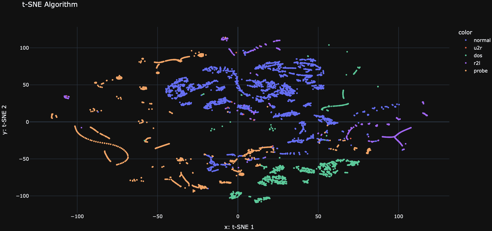
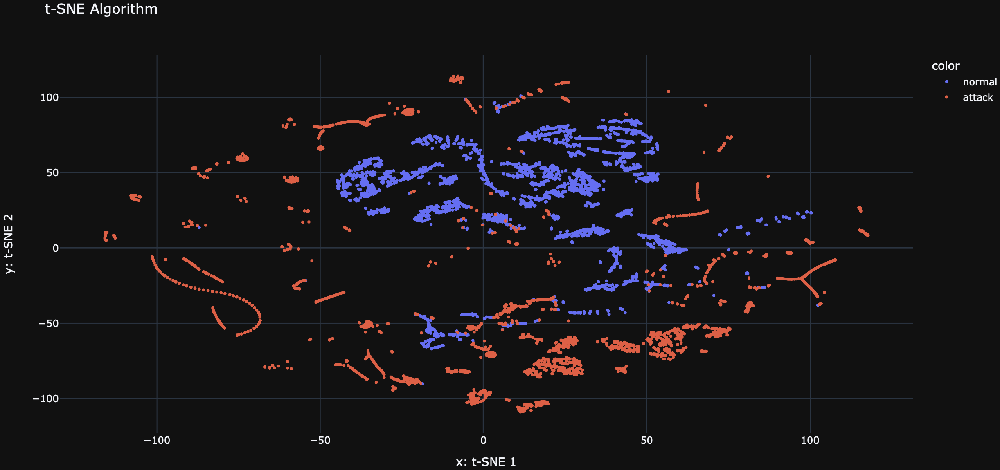

# Network Intrusion Detection System

This repository contains a machine learning project focused on developing a classifier to accurately differentiate between intrusive (malicious) and non-intrusive (benign) network traffic.

## Dataset Source

The dataset utilized in this project is derived from a network environment emulating a standard U.S. Air Force LAN, infused with a variety of simulated attacks. The data, provided by [Lincoln Labs](http://kdd.ics.uci.edu/databases/kddcup99/kddcup99.html), encompasses nine weeks of raw TCP dump data processed into connection records, each uniquely labeled and detailed.

## Project Overview

The goal of this project is to analyze and evaluate methods in the realm of intrusion detection. Using this data, we've constructed a predictive model that classifies network connections as either normal or an attack, with precise categorization of the type of attack when applicable.

### Data Acquisition

The training set includes seven weeks of data resulting in approximately five million records, while the testing set covers two weeks with around two million records. A connection is defined by a sequence of TCP packets marked by a start and end time, traversing from a source to a destination IP address under a specific protocol. Attacks are classified into four principal categories:

- **DOS:** Denial-of-service, such as a SYN flood
- **R2L:** Unauthorized access from a remote machine
- **U2R:** Unauthorized local superuser (root) access attempts
- **Probing:** Reconnaissance activities like port scanning

It is noteworthy that the distribution of the test data differs from the training set, including attack types not present in the training set, adding to the challenge and realism of the detection task.

## Methodology

- Utilization of Data Version Control (DVC) with Google Cloud Platform (GCP) for data storage.
- Removal of correlated variables to mitigate overfitting.
- Employment of a baseline **Random Forest** model with default parameters, achieving an **F1 Score (average weighted) of 99.9752%**. Notably, the **U2R attack classification had a lower F1 Score of 0.67**.
- Application of the **SMOTE algorithm** to oversample the **U2R** class, enhancing it from **52 to 1000** samples. Retraining the Random Forest model with these adjustments led to an **F1 Score (average weighted) of 99.9827%, with a perfect F1 Score of 1.00 for the U2R class**.

## Visualization

To gain insights into the distribution and clustering of the network connections, we utilized the t-SNE (t-Distributed Stochastic Neighbor Embedding) algorithm for dimensionality reduction and visualization. The t-SNE plot below represents the network connections in a two-dimensional space, where each point corresponds to a connection record.

The t-SNE plot provides a visual representation of the relationships between different types of network connections. It helps us understand the patterns and similarities among the connections, which can be useful for identifying clusters and potential anomalies.

By examining the t-SNE plot, we can observe the separation between different attack types and normal connections. This visualization aids in understanding the effectiveness of our model in distinguishing between intrusive and non-intrusive network traffic.

## Model Performance

### Before SMOTE
Here are the classification metrics for our baseline Random Forest model:

| Class  | Precision | Recall | F1-Score | Support |
|--------|-----------|--------|----------|---------|
| dos    | 1.00      | 1.00   | 1.00     | 78292   |
| normal | 1.00      | 1.00   | 1.00     | 19456   |
| probe  | 1.00      | 1.00   | 1.00     | 822     |
| r2l    | 1.00      | 0.96   | 0.98     | 225     |
| **u2r** | **0.75** | **0.60** | **0.67** | **10** |
|        |           |        |          |         |
| Accuracy |       |    | 1.00     | 98805   |
| Macro Avg | 0.95      | 0.91   | 0.93     | 98805   |
| Weighted Avg | 1.00   | 1.00   | 1.00     | 98805   |

> *F1 Score (average weighted) 99.9752%*

### After SMOTE
Following the application of SMOTE to address class imbalance, here are the updated metrics:

| Class  | Precision | Recall | F1-Score | Support |
|--------|-----------|--------|----------|---------|
|  dos   |    1.00   |  1.00  |   1.00   |  78292  |
| normal |    1.00   |  1.00  |   1.00   |  19456  |
| probe  |    1.00   |  0.99  |   1.00   |    821  |
|  r2l   |    1.00   |  0.98  |   0.99   |    225  |
| **u2r** | **0.99** | **1.00** | **1.00** | **200** |
|        |           |        |          |         |
| Accuracy |           |        |   1.00   |  98994  |
| Macro Avg |   1.00   |  0.99  |   1.00   |  98994  |
| Weighted Avg | 1.00 |  1.00  |   1.00   |  98994  |

> *F1 Score (average weighted) 99.9827%*

